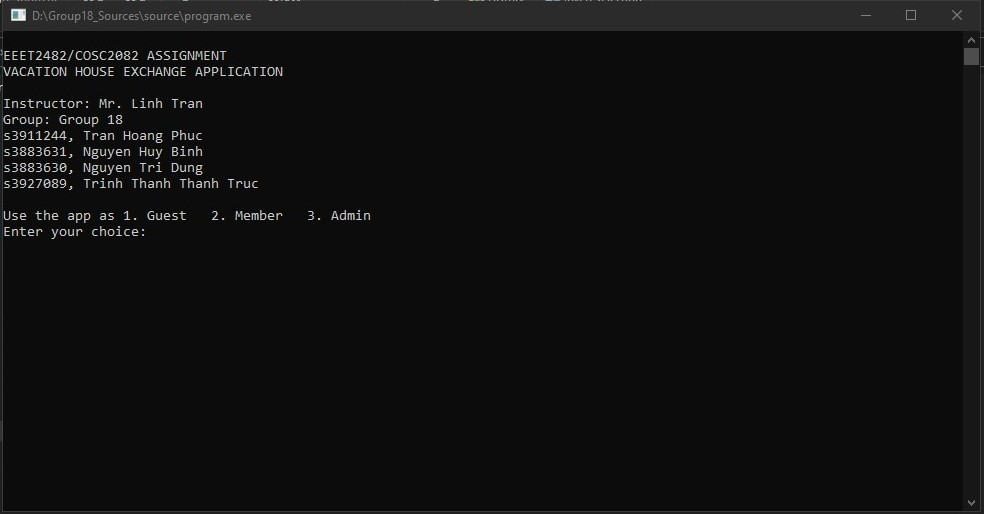
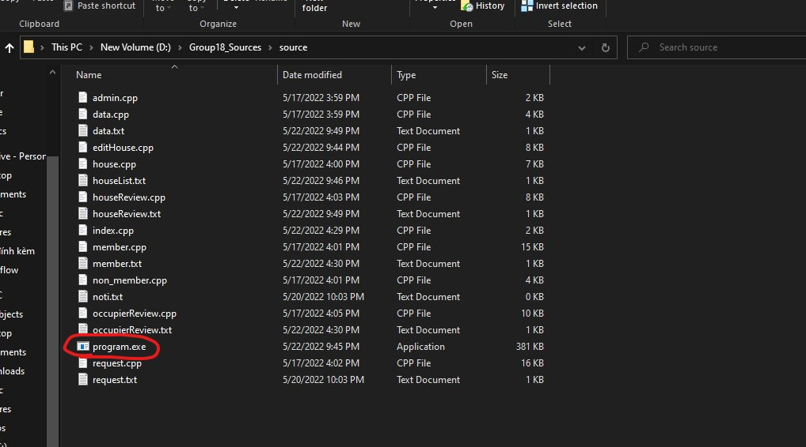
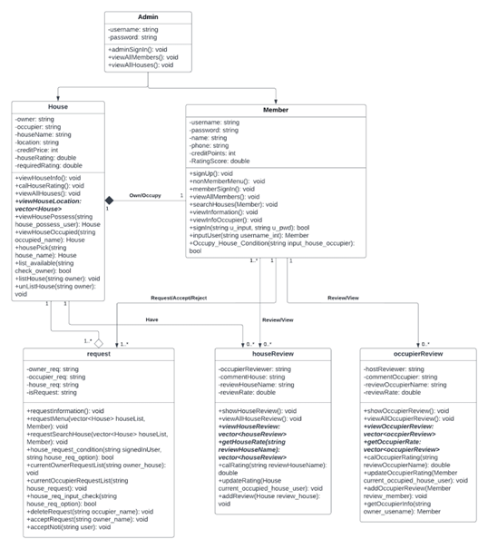

<h1>App For Vacation House Exchange</h1>
 
This is a group C++ project. Me and my teammates developed an application runs on the terminal for vacation house exchange at RMIT University.   

<h2>Installation Guide</h2>
You can git clone the whole file and run program.exe to use the app.  

<h2>Class Diagram</h2>

